# NestJS E-Learning Platform

A NestJS backend for an English learning platform with:
- placement testing (single placement aggregate + embedded questions),
- student groups, roster, and payments,
- authentication, sessions, file upload, and RBAC.

## Tech Stack

- NestJS 11
- TypeORM + PostgreSQL
- JWT authentication
- Swagger/OpenAPI
- ESLint + Prettier

## Main Modules

- `auth`, `users`, `roles`, `statuses`, `session`, `files`
- `placement`, `student-answers`
- `student-groups`, `payments`, `admin`

## Architecture Overview

- The project follows a modular NestJS structure with per-domain modules.
- Each domain uses a layered pattern:
  - `domain/` for core models,
  - `dto/` for request/response contracts,
  - `infrastructure/persistence/` for repositories and TypeORM mappings.
- Shared features (auth, roles, files, sessions, mail) are reused by e-learning domains.
- Persistence currently targets **relational PostgreSQL** with TypeORM.

## Roles and Permissions (Current)

- **Admin**
  - full access to user/admin maintenance endpoints.
- **Tutor** — reserved for future tutor workflows.
- **Student**
  - completes the placement test and views hub data,
  - creates personal payments (`/payments/my`).

> Role guard behavior depends on endpoint decorators and controller-level guards in each module.

## API Groups (v1)

Main route groups are exposed under versioned controllers (for example `/v1/...`):

- `auth`
  - register, login, refresh, me, update me, logout.
- `users`
  - user administration and profile data.
- `placement`, `student-answers`
  - placement test content and submitted answers.
- `student` (hub routes), `admin`
  - learner and staff dashboards.
- `payments`
  - general CRUD + student self-payment endpoints (`/payments/my`).

## Data and Domain Notes

- Placement metadata and questions live on the `placement` row (`questions` JSONB).
- Placement submit computes correctness per answer and stores `student_answer` rows.
- Payment rows link to the student user (Fluentia-style monthly payments).

## Database Lifecycle

Recommended local workflow when schema changes:

```bash
# 1) Generate migration from updated entities
npm run migration:generate -- src/database/migrations/<Name>

# 2) Apply migration
npm run migration:run

# 3) Refresh seed data
npm run seed:run:relational
```

If you need a rollback:

```bash
npm run migration:revert
```

## Quality Checks

```bash
# Static analysis
npm run lint

# Compile/type validation
npm run build

# Unit tests (if available for target module)
npm run test
```

## Quick Start

### 1) Install dependencies

```bash
npm install
```

### 2) Configure environment

Create `.env` from your relational env template (for example `env-example-relational`) and ensure PostgreSQL is running.

### 3) Run migrations

```bash
npm run migration:run
```

### 4) Seed database

```bash
npm run seed:run:relational
```

### 5) Start API

```bash
npm run start:dev
```

## Useful Commands

```bash
# Lint
npm run lint

# Build
npm run build

# Generate migration from entity changes
npm run migration:generate -- src/database/migrations/<MigrationName>

# Rollback last migration
npm run migration:revert
```

## Seeded Test Users

After `npm run seed:run:relational`, the following users are available:

- Admin: `admin@example.com` / `secret`
- Tutor: `jane.tutor@example.com` / `secret`
- Student: `john.student@example.com` / `secret`

## Entity UML Diagram

### SVG Version



## Notes

- `price` and `amount` are currently stored as `integer` columns.
- If you need decimal money precision, migrate them to `numeric(10,2)` (or store minor units like cents).
- Seeders are designed to be idempotent (`ensure*` pattern), so repeated runs should not duplicate core records.
- For production payments, integrate a real provider webhook flow and do not mark status as paid directly from client calls.

